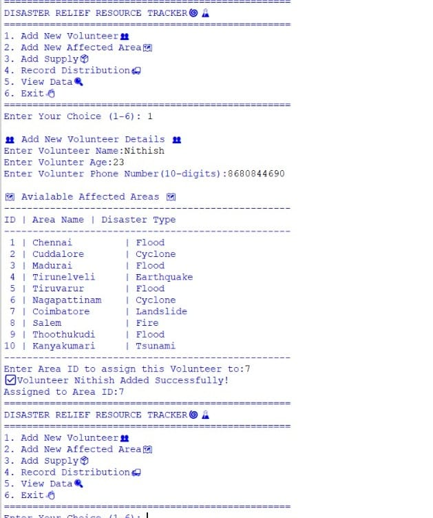
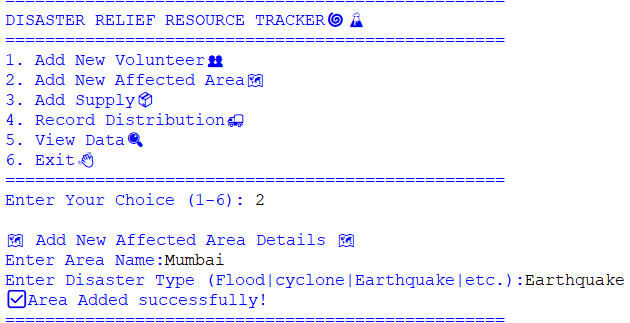
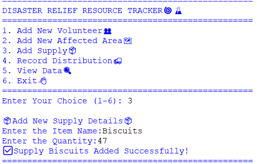
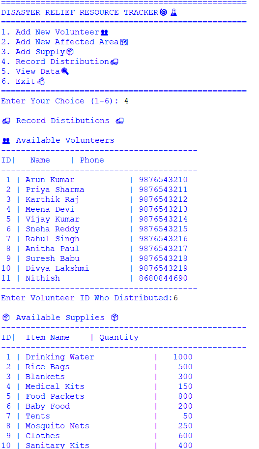
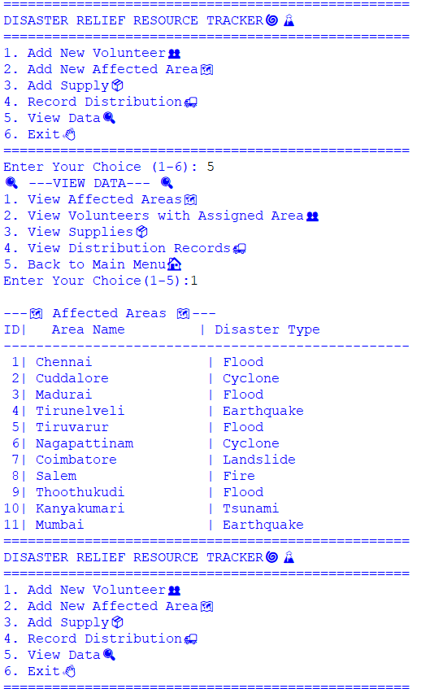

# 🌪️ Disaster Relief Resource Tracker

A Python and MySQL-based console application for managing disaster relief operations. This project helps track affected areas, volunteers, relief supplies, and distribution records through a menu-driven interface.

---

## 📌 Project Overview

The Disaster Relief Resource Tracker is designed to assist relief organizations in managing disaster response efficiently. It stores and manages information about:

- 🗺️ Affected Areas
- 👥 Volunteers
- 📦 Relief Supplies
- 🚚 Distribution Records

The application uses **Python** for the backend logic and **MySQL** for data storage.

---

## ✨ Features

- Add new affected areas
- Register volunteers
- Add relief supplies
- Record supply distributions
- View all stored records
- Automatic table creation if they do not exist

---

## 🛠️ Technologies Used

- Python
- MySQL
- PyMySQL
- MySQL Workbench
- IDLE

---

## 🗄️ Database Tables

- affected_areas
- volunteers
- supplies
- distribution

---

## 📂 Project Structure

```text
Disaster-Relief-Resource-Tracker/
│
├── Tracker 2.0.py
├── README.md
└── screenshots/
```

---

## ▶️ How to Run

1. Install Python.
2. Install MySQL Server and MySQL Workbench.
3. Create a database named `tracker`.
4. Update the MySQL username and password in `Tracker 2.0.py` if needed.
5. Install PyMySQL:

```bash
pip install pymysql
```

6. Run:

```bash
python "Tracker 2.0.py"
```

---

## 📸 Screenshots

Screenshots of the application are included below.

## 📸 Application Screenshots

### 🏠 Main Menu


### 👥 Add Volunteer


### 🗺️ Add Affected Area


### 📦 Add Supply


### 🚚 Record Distribution


### 🔍 View Data


---

## 👨‍💻 Author

**Nithish**

Aspiring Data Analyst | Python | SQL | Power BI | Excel
